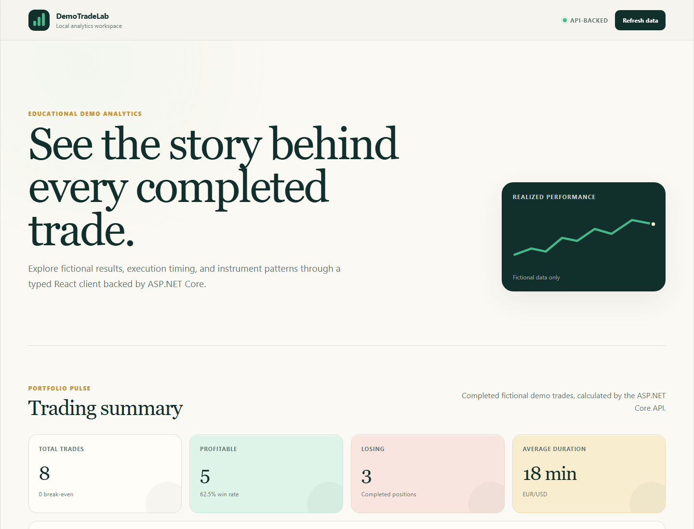

# DemoTradeLab

DemoTradeLab is a full-stack educational trading application built to deepen practical experience with C#, .NET, and ASP.NET Core through a realistic but deliberately local system. It combines a fictional trade-analytics dashboard with backend exercises in transactions, concurrency control, idempotency, recovery, and reconciliation.

All data is fictional or manually entered. The application does not connect to brokerage accounts, submit real orders, or provide trading recommendations.

## What it demonstrates

- A modular-monolith backend with enforced API, Core, and Infrastructure boundaries.
- Domain models that protect trade, balance, reservation, and order invariants.
- Controller-based REST endpoints with explicit DTOs, validation, cancellation, and Problem Details.
- EF Core persistence with SQLite, committed migrations, and explicit transaction boundaries.
- Process-local asynchronous locking for same-account operations.
- Durable idempotency for reservation creation and completion requests.
- A recoverable order workflow with separate failure and compensation transitions.
- Reconciliation that detects balance inconsistencies and unfinished compensation work.
- Deterministic concurrency and rollback tests using the real HTTP-to-SQLite path.
- A typed React and TypeScript dashboard backed by server-side analytics.

## Tech Stack

| Area | Technologies |
| --- | --- |
| Backend | C#, .NET 10, ASP.NET Core controllers, built-in dependency injection and logging |
| Persistence | EF Core 10, SQLite, Fluent configuration, migrations |
| Frontend | React 19, TypeScript, Vite, browser Fetch API |
| Testing | xUnit, `WebApplicationFactory`, temporary SQLite databases, Coverlet collector |
| API tooling | OpenAPI document generation in Development, executable `.http` requests |

## Architecture

DemoTradeLab is a modular monolith. The projects are deployed together, while project references keep responsibilities explicit:

```text
React client ------> DemoTradeLab.Api ------> DemoTradeLab.Core
                           |                         ^
                           v                         |
                 DemoTradeLab.Infrastructure -------+
                           |
                           v
                         SQLite
```

- `DemoTradeLab.Api` owns HTTP endpoints, request/response DTOs, error mapping, and application configuration.
- `DemoTradeLab.Core` owns domain models, business rules, interfaces, and use-case orchestration. It has no dependency on ASP.NET Core or EF Core.
- `DemoTradeLab.Infrastructure` owns EF Core, SQLite, repositories, migrations, seeding, transactions, and the local account-lock implementation.
- Controllers map between HTTP contracts and Core results; they do not return EF Core entities.

See the [detailed architecture](docs/ARCHITECTURE.md) and [architecture diagrams](docs/ARCHITECTURE_DIAGRAM.md).

## Backend Reliability & Engineering Concepts

### Explicit atomic transactions

Reservation and order operations group related balance changes, workflow records, idempotency outcomes, and audit events in an explicit EF Core transaction. A simulated SQLite write failure verifies that partial in-memory changes are not committed and that a later retry can succeed.

### Per-account asynchronous locking

An `IAccountLockManager` implementation uses a keyed `SemaphoreSlim` to serialize operations for the same account inside one API process while allowing different account keys to proceed independently. Cancellation and exception tests verify that leases release correctly.

This is intentionally not described as a distributed lock. Separate application processes would own separate semaphores, and SQLite does not supply the row-locking semantics needed to extend this design automatically to multiple instances.

### Durable idempotency

Reservation creation requires an `Idempotency-Key`. Successful reservations and insufficient-funds rejections are both persisted, allowing a retry to replay the original outcome after a restart. Reusing a key with different input is rejected. Release and consume operations use durable completion records, while order creation and target-state retries return safe no-op results where appropriate.

### Recovery and compensation

The order state machine keeps failure and recovery separate:

```text
Pending -> Completed
Pending -> Failed -> Compensated
```

A failed order deliberately keeps its reservation active so unfinished recovery remains visible. Compensation is a later explicit transaction that releases the funds and records durable order and reservation history.

### Reconciliation

The reconciliation endpoint compares persisted reserved balance with the sum of active reservations and reports failed orders awaiting compensation. It detects inconsistencies but does not automatically repair them, because choosing an authoritative value requires an explicit recovery policy.

### Expected errors versus technical failures

Expected business rejections use result objects and map to validation responses, HTTP 404, or HTTP 409 Problem Details. Unexpected infrastructure failures flow through ASP.NET Core's exception handler as HTTP 500 and are protected by transaction rollback.

## Testing

The current suite contains 77 passing backend tests:

| Test layer | Count | Examples |
| --- | ---: | --- |
| Unit | 39 | Domain invariants, analytics, state machines, service orchestration, idempotent replay |
| Integration | 38 | HTTP contracts, EF mappings, migrations, SQLite persistence, concurrency, rollback and retry |

Notable scenarios include:

- Two concurrent reservations of `80` against a balance of `100` produce one success, one rejection, and a final available balance of `20`.
- Two concurrent requests with the same idempotency key persist one reservation and replay one result.
- Same-account lock acquisition waits, while different accounts use independent locks.
- A temporary SQLite trigger forces a write failure; the transaction rolls back and the operation succeeds after the trigger is removed.
- Reconciliation reports a deliberately corrupted reserved-balance value without silently modifying it.

Concurrency tests use explicit coordination gates instead of timing-dependent sleeps. Integration tests run through ASP.NET Core's test host and isolated temporary SQLite databases.

The frontend currently has lint and production-build validation but no automated component or end-to-end test suite.

See the [testing and debugging guide](docs/TESTING_GUIDE.md) for focused commands, useful breakpoint locations, and an ordered walkthrough of the backend layers.

## Screenshots



The screenshot was captured from the real React application and API using only the committed fictional seed dataset. The current frontend visualizes trade analytics; the reservation and recovery workflows are exercised through the API and automated tests.

## Running Locally

### Prerequisites

- .NET 10 SDK
- Node.js 24 or another version supported by Vite 8
- Git

### Restore, migrate, and run the API

From the repository root:

```powershell
dotnet tool restore
dotnet restore DemoTradeLab.sln
dotnet ef database update `
  --project src/DemoTradeLab.Infrastructure `
  --startup-project src/DemoTradeLab.Api
dotnet run --project src/DemoTradeLab.Api --launch-profile http
```

The default HTTP address is `http://localhost:5122`. In Development, the OpenAPI document is available at `http://localhost:5122/openapi/v1.json`.

Migrations are not applied automatically during API startup. Applying the committed migrations also adds the fictional sample trades and configured demo profiles/accounts to a new database without resetting existing balances.

### Run the frontend

In a second terminal:

```powershell
cd web/demotrade-lab-web
npm ci
npm run dev
```

Open `http://localhost:5173`. Vite proxies relative `/api` requests to the default API address. A separately hosted API can be selected with a local `VITE_API_BASE_URL`; local `.env` files are ignored.

### Verify the repository

```powershell
dotnet format DemoTradeLab.sln --verify-no-changes --no-restore
dotnet build DemoTradeLab.sln --no-restore
dotnet test DemoTradeLab.sln --no-build --no-restore

cd web/demotrade-lab-web
npm run lint
npm run build
npm audit --audit-level=high
```

The repository also includes a GitHub Actions workflow that performs backend and frontend verification on pushes and pull requests.

## API Overview

| Area | Main routes | Purpose |
| --- | --- | --- |
| Health | `GET /api/health` | Typed application health response |
| Trades | `/api/trades` | Create, read, replace, delete, filter, and sort fictional completed trades |
| Analytics | `/api/analytics/*` | Dashboard totals, instrument summaries, and currency-separated profit/loss timelines |
| Demo profiles | `GET /api/demo-profiles` | Persisted fictional profiles, accounts, and calculated balances |
| Reservations | `/api/demo-accounts/{accountId}/reservations` | Idempotent reserve, release, and consume workflows |
| Orders | `/api/demo-accounts/{accountId}/orders` | Order lifecycle, event history, compensation, and reconciliation |

Example requests are available in [`DemoTradeLab.Api.http`](src/DemoTradeLab.Api/DemoTradeLab.Api.http).

## Project Structure

```text
DemoTradeLab/
|-- src/
|   |-- DemoTradeLab.Api/
|   |-- DemoTradeLab.Core/
|   `-- DemoTradeLab.Infrastructure/
|-- tests/
|   |-- DemoTradeLab.UnitTests/
|   `-- DemoTradeLab.IntegrationTests/
|-- web/
|   `-- demotrade-lab-web/
|-- docs/
|-- .github/workflows/
|-- AGENTS.md
|-- README.md
`-- DemoTradeLab.sln
```

Additional documentation:

- [API reference](docs/API_REFERENCE.md)
- [Technical walkthrough](docs/TECHNICAL_WALKTHROUGH.md)
- [Backend learning guide](docs/BACKEND_LEARNING_GUIDE.md)
- [Testing and debugging guide](docs/TESTING_GUIDE.md)
- [Architecture diagram](docs/ARCHITECTURE_DIAGRAM.md)
- [Detailed architecture](docs/ARCHITECTURE.md)
- [Architectural decisions](docs/DECISIONS.md)
- [Completed roadmap](docs/ROADMAP.md)

## Limitations / Educational Scope

- The system is a fictional educational environment, not a brokerage or financial service.
- It has no authentication, authorization, real-account connectivity, live market data, order execution, or trading recommendations.
- SQLite and the in-memory account lock are intended for a single-machine, single-API-process demonstration.
- The lock is not distributed, and the repository does not claim multi-instance concurrency safety.
- Analytics load the bounded local trade dataset into memory; there is no pagination or server-database aggregation strategy for large datasets.
- Reconciliation reports inconsistencies but does not automatically repair them.
- The React dashboard covers trade analytics, not the reservation and order-recovery APIs.
- The frontend has no automated test suite yet.
- Production concerns such as identity, authorization, distributed coordination, deployment, monitoring, tracing, retention, and operational recovery policies are intentionally outside the current scope.
