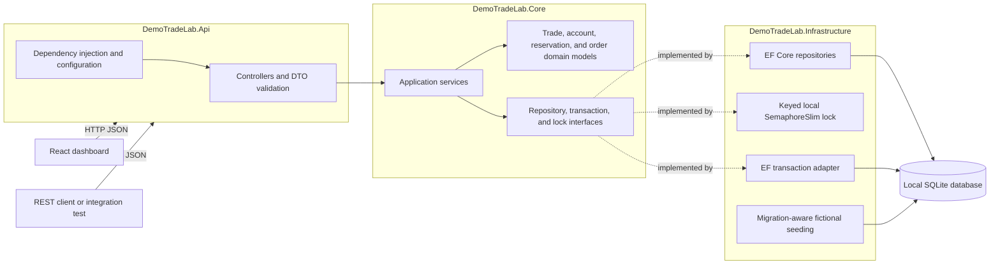
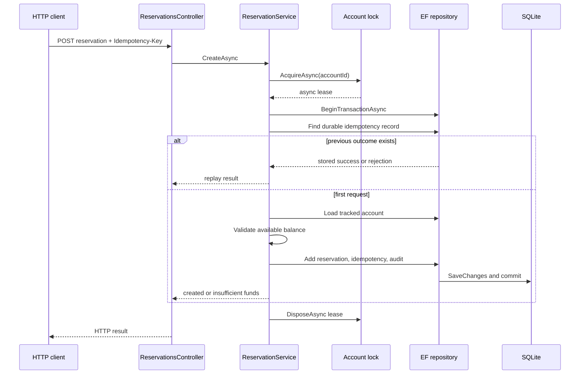
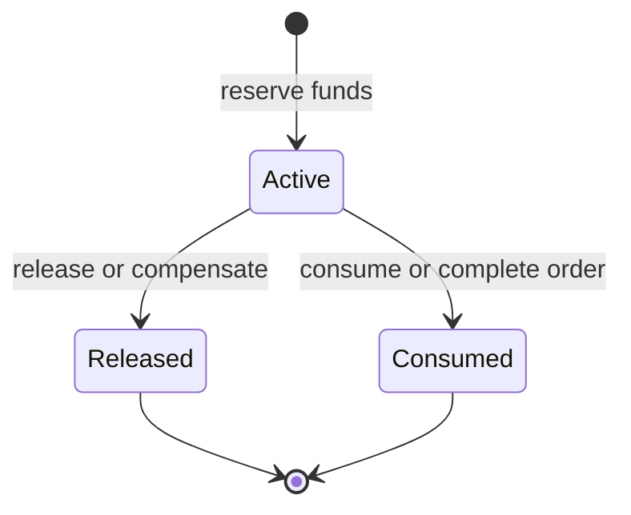
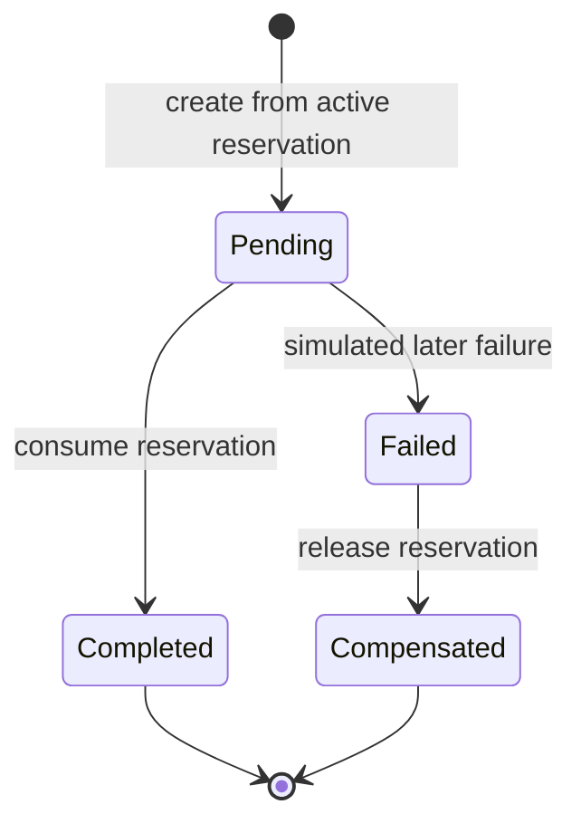

# Architecture Diagram

## Modular monolith and request boundaries

Core has no reference to Api or Infrastructure. Api owns HTTP and configuration. Infrastructure owns technology-specific implementations.

## Atomic reservation creation

## Reservation and order state machines

## Safety boundary

The lock coordinates requests only inside one application process. SQLite transactions and uniqueness constraints provide durable atomicity and idempotency, but the local semaphore is not a distributed lock. A multi-instance variant requires a different coordination design and separate cross-instance verification.
